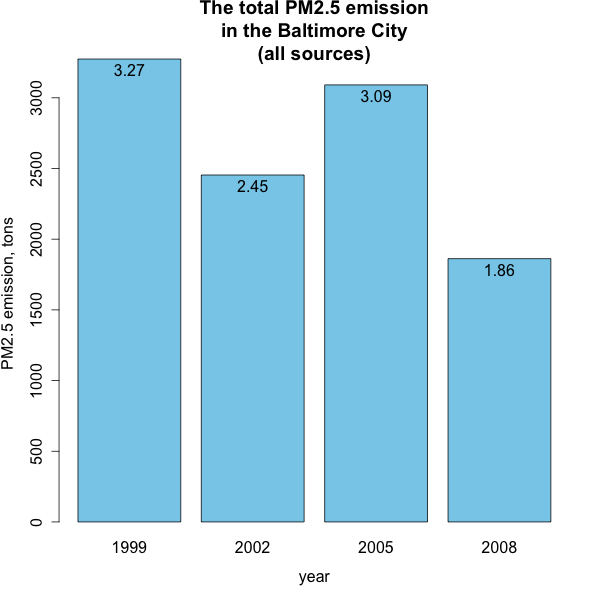
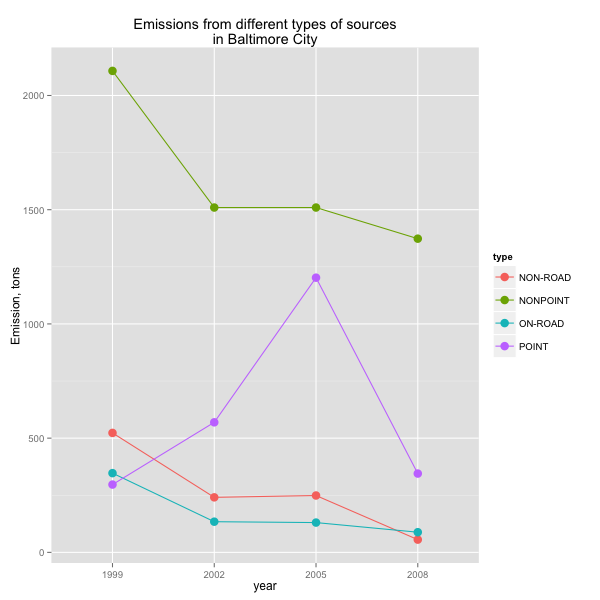

# Exploratory Data Analysis Course Project 1

## Introduction

The overall **goal** here is to examine how household energy usage
varies over a 2-day period in February, 2007. 

The **task** was to reconstruct four plots, all of which were constructed using the base plotting system ([:book: read more about the assignment](https://github.com/rdpeng/ExData_Plotting1)).

## .R files

The separate R code files (`plot1.R`, `plot2.R`, etc.) construct the corresponding plots, i.e. code in `plot1.R` constructs the `plot1.png` plot. The code creating the PNG files (480x480px each) is included.

The code file also includes code for reading the data, so the plots are fully reproduced. 

In this project, only data from the dates 2007-02-01 and 2007-02-02 is used. The script converts `Date` and `Time` variables to a POSIXct variable, `Datetime`.

## How to run the script

To run the script, you need to download the .R file to your computer and, well, run the script.

You can download the <a href="https://d396qusza40orc.cloudfront.net/exdata%2Fdata%2Fhousehold_power_consumption.zip">:package: original .zip-file</a>, unzip it and put the `household_power_consumption.txt` into the folder with the .R file.

What the script does:

* If you don't have `household_power_consumption.txt`, it downloads the data;
* Loads the dataset;
* Subsets the required data;
* Converts `Date` and `Time` variables to a POSIXct variable, `Datetime`;
* Constructs the plot;
* Creates the corresponding PNG file.

## About the dataset

This assignment uses data from the <a href="http://archive.ics.uci.edu/ml/">UC Irvine Machine Learning Repository</a>, a popular repository for machine learning datasets. In particular, the "Individual household electric power consumption Data Set" is used:

* <b>Dataset</b>: <a href="https://d396qusza40orc.cloudfront.net/exdata%2Fdata%2Fhousehold_power_consumption.zip">:package:  Electric power consumption</a> [20Mb]. The dataset has 2,075,259 rows and 9 columns.

* <b>Description</b>: Measurements of electric power consumption in one household with a one-minute sampling rate over a period of almost 4 years. Different electrical quantities and some sub-metering values are available.

The following descriptions of the 9 variables in the dataset are taken
from the <a href="https://archive.ics.uci.edu/ml/datasets/Individual+household+electric+power+consumption">UCI web site</a>:

<ol>
<li><b>Date</b>: Date in format dd/mm/yyyy </li>
<li><b>Time</b>: time in format hh:mm:ss </li>
<li><b>Global_active_power</b>: household global minute-averaged active power (in kilowatt) </li>
<li><b>Global_reactive_power</b>: household global minute-averaged reactive power (in kilowatt) </li>
<li><b>Voltage</b>: minute-averaged voltage (in volt) </li>
<li><b>Global_intensity</b>: household global minute-averaged current intensity (in ampere) </li>
<li><b>Sub_metering_1</b>: energy sub-metering No. 1 (in watt-hour of active energy). It corresponds to the kitchen, containing mainly a dishwasher, an oven and a microwave (hot plates are not electric but gas powered). </li>
<li><b>Sub_metering_2</b>: energy sub-metering No. 2 (in watt-hour of active energy). It corresponds to the laundry room, containing a washing-machine, a tumble-drier, a refrigerator and a light. </li>
<li><b>Sub_metering_3</b>: energy sub-metering No. 3 (in watt-hour of active energy). It corresponds to an electric water-heater and an air-conditioner.</li>
</ol>

## Plots

